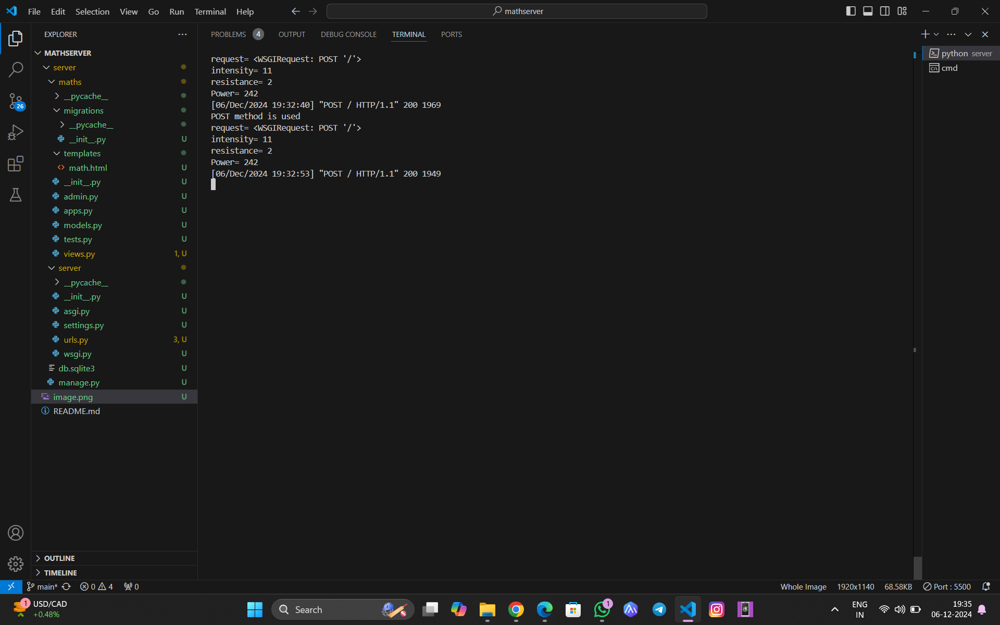
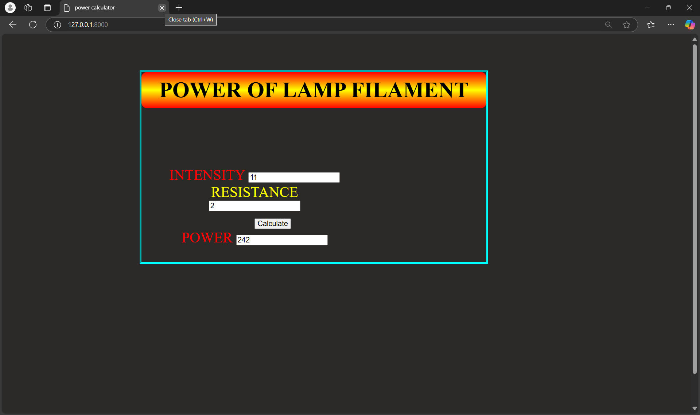

# Ex.05 Design a Website for Server Side Processing
# Date:06.12.2024
# AIM:
To design a website to calculate the power of a lamp filament in an incandescent bulb in the server side.

# FORMULA:
P = I2R
P --> Power (in watts)
 I --> Intensity
 R --> Resistance

# DESIGN STEPS:
## Step 1:
Clone the repository from GitHub.

## Step 2:
Create Django Admin project.

## Step 3:
Create a New App under the Django Admin project.

## Step 4:
Create python programs for views and urls to perform server side processing.

## Step 5:
Create a HTML file to implement form based input and output.

## Step 6:
Publish the website in the given URL.

# PROGRAM :

```
math.html

<html lang="en" >
<head>
    <meta charset="UTF-8">
    <meta name="viewport" content="width=device-width, initial-scale=1.0">
    <title>power calculator
    
    </title>
    <style>

    #img{
    font-size: 40px;
    padding: 60px;
    margin-top:100px;
    height: 600px;
    
    width: 500px;
    
    }
    form{
        border:5px inset aqua;
        width: 50%;
        height: 50%;
        position: absolute;
    }
    label{
        color: red;
        margin-top: 40px;
    }
    #res{
        color:yellow;
    }
    body{
        margin-left: 20%;
        margin-top:100px;
        
        
    }
    #topic{
        background: linear-gradient(to bottom, red,yellow,red);
        padding: 15px;
        font-size:60px;
        border-radius: 15px;
    }
    html{
        background: #2c2929;
    }
    input{
        font-size: 20px;
    }
    button{
        margin-top: 20px;
        font-size: 20px;
        margin-left:100px;
    }
    
    </style>
</head>
<body >
    <form method="POST">
            <div id="topic" align="center"><b>POWER OF LAMP FILAMENT</b></div>
            <div align="center" id="img" >
    
    
            <label name='intensity' for="INTENSITY">INTENSITY</label>
                <input type="text" name='intensity' placeholder="Enter intensity" id="intensity" value="{{i}}"> <br>
        
             
           <label name="resistance" for="RESISTANCE" id="res">RESISTANCE</label>
                <input type="text " name="resistance" placeholder="Enter resistance" id="resistance" value="{{r}}"> <br>
         
            <button type="submit">Calculate</button> <br>
            <label name="power" for="POWER">POWER</label>

            <input type="text" placeholder="Answer" id="power" name="power" value="{{power}}" >
            
        </div>
    </form>

</body>
</html>


views.py
from django.shortcuts import render
def powerlamp(request): 
    context={} 
    context['power']="0" 
    context['i']="0" 
    context['r']="0" 
    if request.method=='POST': 
        print("POST method is used")
        i=request.POST.get('intensity','0')
        r=request.POST.get('resistance','0')
        print('request=',request) 
        print('intensity=',i) 
        print('resistance=',r) 
        power=(int(i) ** 2 ) * int(r) 
        context['power']=power
        context['i']=i
        context['r']=r 
        print('Power=',power) 
    return render(request,'math.html',context)


urls.py

from django.contrib import admin 
from django.urls import path 
from maths import views 
urlpatterns = [ 
    path('admin/', admin.site.urls), 
    path('powerlamp/',views.powerlamp,name="powerlamp"),
    path('',views.powerlamp,name="powerlamproot")
]
```
# SERVER SIDE PROCESSING:

# HOMEPAGE:

# RESULT:
The program for performing server side processing is completed successfully.
